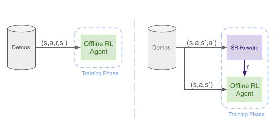

# SR-Reward
Implementation of [SR-Reward: Taking The Path More Traveled](https://openreview.net/forum?id=bzk1sV1svm) by Seyed Mahdi Basiri Azad (Erfan), Zahra Padar, Gabriel Kalweit and Joschka Boedecker.

SR-Reward is a reward module based on successor representations (SR) that can be used to train agents in environments witout access to rewards, but with access to demonstrations. the reward module is decoupled from the policy and can be trained independently and hence is compatible with most RL algorithms. 

# Setup Instructions:
## Create a conda environment
```
conda create -n sr-reward python=3.10
conda activate sr-reward
```
## Install dependencies
```
git clone git@github.com:Erfi/SR-Reward.git
cd SR-Reward
pip install -r requirements.txt
git submodule update --init --recursive
cd imitation
pip install -e .
```

## To download and process D4RL datasets (e.g. hopper environment)
```python main.py mode=d4rl_data environment=hopper environment.config.history_len=1```

## To train a model (e.g. sparseql on hopper environment)
```python main.py mode=train_irl algorithm=sparseql environment=hopper wb.entity=YOUR_WB_PROJECT wb.group=YOUR_WB_GROUP memory.saved_memory_filename=demos/hopper_expert_demo.pkl```

## To evaluate a model (e.g. sparseql on hopper environment)
```python main.py mode=evaluate algorithm=sparseql environment=hopper algorithm.saved_model_path=models/sparseql/Hopper/default/seed_0/250604_140507__1197913/best_model.zip```


## Citation
If you build on our work or find it useful, please cite it using the following bibtex.

```
@article{azad2025sr-reward,
    title={SR-Reward: Taking The Path More Traveled},
    author={Seyed Mahdi B. Azad and Zahra Padar and Gabriel Kalweit and Joschka Boedecker},
    journal={Transactions on Machine Learning Research},
    year={2025},
    url={https://openreview.net/forum?id=bzk1sV1svm},
}
```

## License

This project is licensed under the MIT License - see the [LICENSE](LICENSE) file for details.